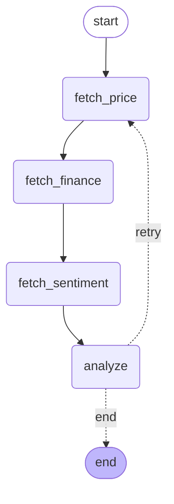

# Agent Runtime

基于 LangGraph 自研的企业级 Agent 编排运行时，以泡泡玛特（09992.HK）为实例底座，核心能力：**durable execution（持久化断点续跑）**。

## 架构



## 核心能力

- **断点续跑**：每个节点执行后状态落盘到 PostgreSQL，进程崩溃后用同一个 thread_id 恢复，已完成节点不重跑
- **条件边**：analyze 节点根据数据质量动态决定结束或重试，最多重试 2 次
- **提示词约束**：LLM 数据异常时输出固定标记 DATA_INVALID，程序可靠检测
- **双通道告警**：超限时 Langfuse 记录（事后分析）+ Lark 实时通知
- **真实数据**：行情、财报、舆情等多源接入

## 技术栈

| 层 | 技术 |
|---|---|
| 编排引擎 | LangGraph 1.2.x |
| 状态持久化 | PostgreSQL + langgraph-checkpoint-postgres |
| LLM | DeepSeek（OpenAI 兼容接口） |
| 可观测 | Langfuse |
| 告警 | Lark Webhook |
| 数据源 | popmart_data_aggregator（FastAPI） |

## 快速启动

**环境要求**
- Python 3.11
- PostgreSQL

**安装**

```bash
conda create -n langgraph-runtime python=3.11 -y
conda activate langgraph-runtime
pip install langgraph langchain-openai langgraph-checkpoint-postgres "psycopg[binary]" langfuse python-dotenv
```

**配置 `.env`**

```
DEEPSEEK_API_KEY=你的key
LANGFUSE_PUBLIC_KEY=pk-lf-xxx
LANGFUSE_SECRET_KEY=sk-lf-xxx
LANGFUSE_HOST=http://localhost:3010
LARK_WEBHOOK_URL=https://open.larksuite.com/open-apis/bot/v2/hook/xxx
LARK_SECRET=你的签名key
```

**运行**

```bash
python main.py
```

## 项目结构

```
agent-runtime/
├── src/
│   ├── state.py      # State 定义（TypedDict）
│   ├── nodes.py      # 四个节点 + 路由函数
│   ├── graph.py      # StateGraph 连图
│   └── alert.py      # Langfuse + Lark 告警
├── main.py           # 入口（自动判断首次/断点恢复）
├── .env              # 配置（不提交）
└── README.md
```